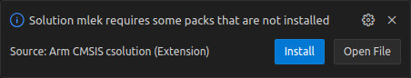
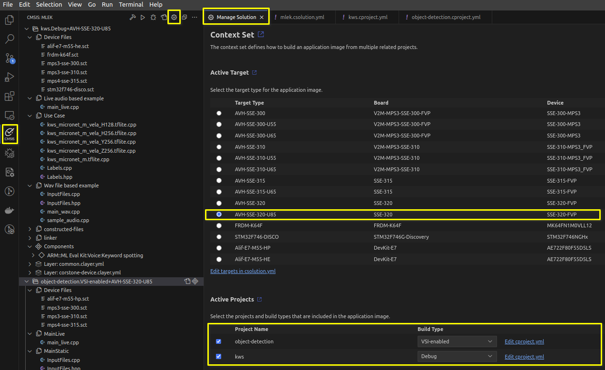

[](https://github.com/Arm-Examples/mlek-cmsis-pack-examples/blob/main/LICENSE)
[](/.github/workflows/AVH-FVP-CI.yml)
[](./.github/workflows/Hardware-CI.yml)

# CMSIS-Pack based Machine Learning Examples

- [CMSIS-Pack based Machine Learning Examples](#cmsis-pack-based-machine-learning-examples)
- [Introduction](#introduction)
  - [Examples](#examples)
  - [Target platforms](#target-platforms)
- [Overview](#overview)
  - [Object detection](#object-detection)
  - [Keyword spotting](#keyword-spotting)
- [Prerequisites](#prerequisites)
  - [Visual Studio Code](#visual-studio-code)
  - [Packs](#packs)
  - [Virtual Streaming Interface](#virtual-streaming-interface)
- [Building the examples](#building-the-examples)
  - [Launch project in Visual Studio Code](#launch-project-in-visual-studio-code)
  - [Download Software Packs](#download-software-packs)
  - [Generate and build the project](#generate-and-build-the-project)
  - [Command-line builds](#command-line-builds)
  - [Execute Project](#execute-project)
    - [Working with Virtual Streaming Interface](#working-with-virtual-streaming-interface)
      - [Arm MPS3 based FVPs](#arm-mps3-based-fvps)
      - [Arm MPS4 based FVPs](#arm-mps4-based-fvps)
  - [Application output](#application-output)
- [Trademarks](#trademarks)
- [Licenses](#licenses)
- [Troubleshooting and known issues](#troubleshooting-and-known-issues)

# Introduction

This repository contains Machine Learning (ML) examples using the CMSIS-Pack from
[ML Embedded Evaluation Kit](https://gitlab.arm.com/artificial-intelligence/ethos-u/ml-embedded-evaluation-kit).

## Examples

Currently, the following examples are supported:

- **Object detection** - detects objects in the input image.
- **Keyword spotting** - detects specific keywords in the input audio stream.

## Target platforms

Target platforms supported:

| Name                         | Type                | IP                                            | Examples |
|------------------------------|---------------------|-----------------------------------------------|----------|
| Arm® Corstone™-300           | Virtual or physical | Arm® Cortex®-M55 CPU                          | All      |
| Arm® Corstone™-300-U55       | Virtual or physical | Arm® Cortex®-M55 CPU with Arm® Ethos™-U55 NPU | All      |
| Arm® Corstone™-300-U65       | Virtual or physical | Arm® Cortex®-M55 CPU with Arm® Ethos™-U65 NPU | All      |
| Arm® Corstone™-310           | Virtual or physical | Arm® Cortex®-M85 CPU                          | All      |
| Arm® Corstone™-310-U55       | Virtual or physical | Arm® Cortex®-M85 CPU with Arm® Ethos™-U55 NPU | All      |
| Arm® Corstone™-310-U65       | Virtual or physical | Arm® Cortex®-M85 CPU with Arm® Ethos™-U65 NPU | All      |
| Arm® Corstone™-315           | Virtual or physical | Arm® Cortex®-M85 CPU                          | All      |
| Arm® Corstone™-315-U65       | Virtual or physical | Arm® Cortex®-M85 CPU with Arm® Ethos™-U65 NPU | All      |
| Arm® Corstone™-320           | Virtual or physical | Arm® Cortex®-M85 CPU                          | All      |
| Arm® Corstone™-320-U85       | Virtual or physical | Arm® Cortex®-M85 CPU with Arm® Ethos™-U85 NPU | All      |
| Alif™ Ensemble™ E7 AI/ML Kit | Physical board      | Arm® Cortex®-M55 CPU with Arm® Ethos™-U55 NPU | All      |
| STM32® F746G-Discovery       | Physical board      | Arm® Cortex®-M7 CPU                           | KWS      |
| NXP® FRDM-K64F               | Physical board      | Arm® Cortex®-M4 CPU                           | KWS      |

All listed Arm® Ethos™-U NPU variants are supported, including Ethos™-U55,
Ethos™-U65 and Ethos™-U85.

# Overview

The examples presented in this repository showcase how to build and deploy end-to-end Machine
Learning applications using existing code from various CMSIS-packs. These examples are built
using Google's [TensorFlow Lite Micro framework](https://www.tensorflow.org/lite/microcontrollers)
and Arm's [ML Embedded Evaluation Kit](https://review.mlplatform.org/plugins/gitiles/ml/ethos-u/ml-embedded-evaluation-kit/+/refs/heads/main/Readme.md)
API's. The embedded evaluation kit API pack has ready-to-use machine learning API's for several
use cases covering typical `voice`, `vibration` and `vision` applications.

The examples are set up to use the NPU by default on NPU-enabled targets, with unsupported
operators falling back on the CPU. The neural network model files used for Arm® Ethos™-U targets
have been pre-optimised by the [Vela compiler](https://pypi.org/project/ethos-u-vela/) while the
files used for pure CPU targets are used as they are. The Keyword spotting (KWS) project can be
built for physical targets too.

## Object detection

This example uses a neural network model that specialises in detecting human faces in images.
The input size for these images is 192x192 (monochrome) and the smallest face that can be
detected is of size 20x20. The output of the application will be co-ordinates for rectangular
bounding boxes for each detection.

## Keyword spotting

This example can detect up to twelve keywords in the input audio stream. The
[audio file used](./resources/sample_audio.wav) contains the keyword "down" being spoken.

More details about the input for this example can be found [here](https://review.mlplatform.org/plugins/gitiles/ml/ethos-u/ml-embedded-evaluation-kit/+/refs/heads/main/docs/use_cases/kws.md#preprocessing-and-feature-extraction).

# Prerequisites

## Visual Studio Code

We recommend using [Visual Studio Code IDE](https://code.visualstudio.com/) with the
[Keil Studio Pack Extension](https://marketplace.visualstudio.com/items?itemName=Arm.keil-studio-pack).

Once the IDE has been set up with the extension, it presents an easy to use interface to build
applications for specific configurations of the different projects and targets from within VS Code,
and also helps with debugging and flashing.

The extension also configures the repository's `vcpkg` environment. Once that setup has completed,
the integrated VS Code terminal should have the CMSIS-Toolbox commands, including `cbuild`,
`csolution` and `cpackget`, available on `PATH`.

For developing on a local host machine, we recommend a Linux based system as we test
the flow of the instructions in that environment, but a Windows based machine should
also work.

## Packs

CMSIS-Pack defines a standardized way to deliver software components, device parameters and board
support information and code. A list of available CMSIS-Packs can be found
[here](https://developer.arm.com/tools-and-software/embedded/cmsis/cmsis-packs).

## Virtual Streaming Interface

[Virtual Streaming Interface](https://arm-software.github.io/AVH/main/simulation/html/group__arm__vsi.html)
(VSI) is available for certain
[Fixed Virtual Platform](https://developer.arm.com/Tools%20and%20Software/Fixed%20Virtual%20Platforms) (FVP) or
[Arm Virtual Hardware](https://developer.arm.com/Tools%20and%20Software/Arm%20Virtual%20Hardware) (AVH)
targets. For VSI supported examples, you may need to install some dependencies.

For more details and up-to-date requirements, see
[Python environment setup](https://arm-software.github.io/AVH/main/simulation/html/group__arm__vsi__pyenv.html)
which mentions:

> The following packages are required on Linux systems (Ubuntu 20.04 and later):
>   - libatomic1
>   - python3.9
>   - python3-pip

In addition to the above, the VSI Python scripts depend on `opencv-python` package. We recommend using
a virtual environment and installing this with pip.

```shell
$ pip install opencv-python "numpy<2.0.0"
```

**NOTE**: The requirement for Python version is driven by the FVP executable. Versions <= 11.26 require
Python3.9 but this may change for future releases.

# Building the examples

## Launch project in Visual Studio Code

Upon opening the project in Visual Studio Code, `vcpkg` will automatically install the required packages as specified in
the manifest file [vcpkg-configuration.json](vcpkg-configuration.json). These may include the FVP binaries.

## Download Software Packs

Once `vcpkg` has finished configuring the environment, a prompt will appear to install the required CMSIS packs for this project:



Recent versions of CMSIS toolbox will automatically install the missing packs when a project is built.

Alternatively, the packs can be installed manually by opening up a Terminal in Visual Studio Code (Ctrl + Shift + `) and running the following commands:

```
$ csolution list packs -s mlek.csolution.yml -m > packlist.txt
$ cpackget add -f packlist.txt
```

## Generate and build the project

Use the CMSIS tab in the Activity Bar to build, run and debug the use case samples for a particular target type.



Simply use the drop-down menus to specify your build, then click the Build button.  The output should look similar to the following:

```log
 *  Executing task: cmsis-csolution.build: Build
> cbuild <repo>/mlek.csolution.yml --update-rte --packs --context object-detection.Release+AVH-SSE-300-U55
+-----------------------------------------------------------------
(1/1) Building context: "object-detection.Release+AVH-SSE-300-U55"
Using AC6 V6.24.0 compiler, from: '<path-to-arm-compiler>/bin'
Building CMake target 'object-detection.Release+AVH-SSE-300-U55'
[1/345] Building CXX object CMakeFiles/Group_MainStatic.dir/<repo>/object-detection/src/InputFiles.o
[2/345] Building C object CMakeFiles/Group_Retarget.dir/<repo>/device/corstone/src/retarget.o
...
...
[345/345] Linking CXX executable <repo>/out/object-detection/AVH-SSE-300-U55/Release/object-detection.axf
+------------------------------------------------------------
Build summary: 1 succeeded, 0 failed - Time Elapsed: 00:00:23
+============================================================
Build complete
 *  Terminal will be reused by tasks, press any key to close it.
```

The built artifacts will be located under the `out/` directory in the project root.

## Command-line builds

Command-line builds use CMSIS-Toolbox. Developers using VS Code should use the integrated terminal
after the Keil Studio Pack Extension has finished configuring `vcpkg`; the required CMSIS-Toolbox,
CMake and Ninja tools are then available on `PATH`.

For a standalone terminal, install a recent CMSIS-Toolbox release from the
[Open-CMSIS-Pack devtools releases](https://github.com/Open-CMSIS-Pack/devtools/releases),
add its `bin` directory to `PATH`, and point CMSIS-Toolbox at Arm Compiler for Embedded:

```shell
$ export PATH="${PATH}:/path/to/cmsis-toolbox/bin"
$ export AC6_TOOLCHAIN_6_24_0=/path/to/ArmCompilerforEmbedded6.24/bin
```

List all build contexts from the solution:

```shell
$ cbuild list contexts ./mlek.csolution.yml
```

Then build a selected context:

```shell
$ cbuild ./mlek.csolution.yml -c kws.Release+AVH-SSE-300-U55 --update-rte
$ cbuild ./mlek.csolution.yml -c object-detection.Release+AVH-SSE-300-U55 --update-rte
```

The same command pattern applies to any context reported by `cbuild list contexts`, including
the `-U55`, `-U65` and `-U85` NPU variants.

Both commands generate or update RTE files as needed and place build products under `out/`.
Depending on how CMSIS-Toolbox was installed, `cbuild` may print a `manifest file does not exist`
warning before the context list or build log; this warning is benign if the context still builds.

## Execute Project

The project is configured for execution on Arm Virtual Hardware which removes the requirement for
a physical hardware board.

- When using a Fixed Virtual Platform (FVP) installed locally by `vcpkg`:
  ```shell
  $ FVP_Corstone_SSE-300_Ethos-U55 \
    -a out/object-detection/AVH-SSE-300-U55/Release/object-detection.axf \
    -f device/corstone/fvp-configs/mps3_fvp_config.txt
  ```
  > **NOTE**: The FVP defaults to running 128 MAC configuration for Arm® Ethos™-U55 NPU.
  > However, our default neural network model for the NPU is for 256 MAC configuration. The FVP
  > configuration file sets the MAC units to be 256.
  > Use the matching FVP, build context, executable path and configuration file for other
  > supported NPU variants.

> **Note:** Arm Virtual Hardware models are also available on AWS Marketplace.

For physical targets supported, the boards should enumerate as mass storage devices once connected
via USB to the host machine. Once this happens, copy over the bin file from the generated build
to this storage device. Once copied the mass storage device will automatically disconnect,
re-enumerate and start the program it has been just flashed with.

For example:

```shell
$ cp ./out/kws/STM32F746-DISCO/Release/kws.Release+STM32F746-DISCO.bin /media/user/DIS_F746NG/ && sync
```

### Working with Virtual Streaming Interface

The object detection example supports the Virtual Streaming Interface (VSI) feature found in the
FVPs for Arm Corstone-300, Corstone-310, Corstone-315 and Corstone-320. To build the example with
VSI support, switch the build type to `VSI-enabled`. This allows the locally installed FVP
application to read images in from a camera connected to your host machine and stream these over
to the application running within the FVP.

To run the VSI application, append the command line with the v_path argument. For example:

#### Arm MPS3 based FVPs

For Arm Corstone-300 and Arm Corstone-310:

```shell
  $ <path_to_installed_FVP> \
    -a ./out/object-detection/AVH-SSE-300-U55/VSI-enabled/object-detection.axf \
    -f ./device/corstone/fvp-configs/mps3_fvp_config.txt \
    -C mps3_board.v_path=./device/corstone/vsi/video/python/
  ```

#### Arm MPS4 based FVPs

For Arm Corstone-315 and Arm Corstone-320:

```shell
  $ <path_to_installed_FVP> \
    -a ./out/object-detection/AVH-SSE-320-U85/VSI-enabled/object-detection.axf \
    -f ./device/corstone/fvp-configs/mps4_fvp_config.txt \
    -C mps4_board.v_path=./device/corstone/vsi/video/python/
```

## Application output

Once the project can be built successfully, the execution on target hardware will show output from
the application. Currently, this includes the following:
  - Arm® Ethos™-U NPU version information
  - Information about model's memory allocation
  - Running inference on specified input
  - Output of inference
  - Simulation information such as simulated time, user time, system time, etc

Note that most applications will redirect their standard output and error streams to a UART module.
Use a serial terminal to monitor these streams when running on physical hardware.

For the Alif Semiconductor™ Ensemble™ AI/ML kit boards, the output over UART is wired through port
J2 (marked PRG_USB). This port exposes two UARTs - one for SE (Secure Enclave) and the other is
configurable to pass through either UART2 or UART4 using jumpers on J15. For the applications built,
the high performance core uses UART4, and the high efficiency core uses UART2.

J15 setup is shown below:

```
J15-1-3 & 2-4:  SE UART
J15-3-5 & 4-6:  UART2
J15-5-7 & 6-8:  UART2
J15-7-9 & 8-10: UART4
```
For all other targets, serial is available over USB from primary debug/connection port.

Sample output for `STM32F746G-DISCO` target:

```
INFO - Added  support to op resolver
INFO - Creating allocator using tensor arena at 0x20000460
INFO - Allocating tensors
INFO - Model INPUT tensors:
INFO -  tensor type is INT8
INFO -  tensor occupies 490 bytes with dimensions
INFO -          0:   1
INFO -          1:  49
INFO -          2:  10
INFO -          3:   1
INFO - Quant dimension: 0
INFO - Scale[0] = 0.201095
INFO - ZeroPoint[0] = -5
INFO - Model OUTPUT tensors:
INFO -  tensor type is INT8
INFO -  tensor occupies 12 bytes with dimensions
INFO -          0:   1
INFO -          1:  12
INFO - Quant dimension: 0
INFO - Scale[0] = 0.056054
INFO - ZeroPoint[0] = -54
INFO - Activation buffer (a.k.a tensor arena) size used: 103484
INFO - Number of operators: 14
INFO -  Operator 0: CONV_2D
INFO -  Operator 1: DEPTHWISE_CONV_2D
INFO -  Operator 2: CONV_2D
INFO -  Operator 3: DEPTHWISE_CONV_2D
INFO -  Operator 4: CONV_2D
INFO -  Operator 5: DEPTHWISE_CONV_2D
INFO -  Operator 6: CONV_2D
INFO -  Operator 7: DEPTHWISE_CONV_2D
INFO -  Operator 8: CONV_2D
INFO -  Operator 9: DEPTHWISE_CONV_2D
INFO -  Operator 10: CONV_2D
INFO -  Operator 11: AVERAGE_POOL_2D
INFO -  Operator 12: CONV_2D
INFO -  Operator 13: RESHAPE
AUDIO recording configured from digital microphones (U20 & U21)
INFO - Inference #: 7
INFO - Detected: stop; Prob: 0.94
INFO - Inference #: 20
INFO - Detected: left; Prob: 0.98
```

The output is different for the two example applications:
  - object detection application will detect two objects on the sample input image and will
    present the detected bounding boxes for objects in the image.
  - keyword spotting application will detect a keyword in the sample audio file and will present
    the highest confidence score and the associated keyword label.

For STM32F746G-DISCO board, the LCD is also used to display the last keyword detected.


# Trademarks

- Arm® and Cortex® are registered trademarks of Arm® Limited (or its subsidiaries) in the US and/or elsewhere.
- Arm® and Ethos™ are registered trademarks or trademarks of Arm® Limited (or its subsidiaries) in the US and/or
  elsewhere.
- Arm® and Corstone™ are registered trademarks or trademarks of Arm® Limited (or its subsidiaries) in the US and/or
  elsewhere.
- Arm®, Keil® and µVision® are registered trademarks of Arm Limited (or its subsidiaries) in the US and/or elsewhere.
- TensorFlow™, the TensorFlow logo, and any related marks are trademarks of Google Inc.
- ST®, STM32® are registered trademarks of companies belonging to the STMicroelectronics Group.
- NXP® and the NXP logo are trademarks of NXP B.V.
- Alif™, Alif Semiconductor™, Crescendo™ and Ensemble™ are all trademarks of Alif Semiconductors.
- Visual Studio Code, VS Code, and the Visual Studio Code icon are trademarks of Microsoft Corporation.

# Licenses

The application samples and [resources](./resources) are provided under the Apache 2.0 license, see [License](./LICENSE).

Application input data sample files (audio or image files) and the neural network model files have
been converted into C/C++ type arrays and are distributed under Apache 2.0 license. The models have
been processed by the [Vela compiler](https://pypi.org/project/ethos-u-vela/) and then converted
into C/C++ arrays to be baked into the example applications.

| Example | Licence | Provenance |
|---------------|---------|---------|
| Keyword Spotting | Apache 2.0 | [micronet_medium](https://github.com/ARM-software/ML-zoo/raw/9f506fe52b39df545f0e6c5ff9223f671bc5ae00/models/keyword_spotting/micronet_medium/tflite_int8/) |
| Object Detection | Apache 2.0 | [yolo-fastest_192_face_v4](https://github.com/emza-vs/ModelZoo/blob/v1.0/object_detection/) |

# Troubleshooting and known issues

Many of the tools we have used are still in beta testing phase and there can be issues we don't
spot immediately. Please help us improve this section by reporting them via GitHub.

1. While debugging the KWS application, the STM32F746G board does not recognise keywords at all.

   This is because for a debug configuration the inference process is much slower. It therefore
   skips audio quite easily and the input data, as seen by the application, is not as
   continuous in time as it needs to be for decent detections. The audio capture and inference
   processes are running in parallel, so while the inference is going, or part of the application
   is at a breakpoint, it is quite likely for the audio buffer to be overwriting itself.
